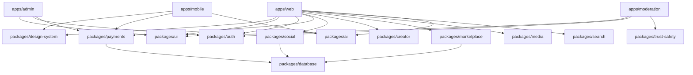

# AUDIT/ARCHITECTURE-AUDIT.md — TUKUBI System Architecture & Domain Boundaries Audit

**Architecture Standard:** Monorepo Domain-Driven Architecture (ADR-001 through ADR-013)  
**Total Domain Packages:** 23 (`packages/*`)  
**Coupling Grade:** 🟢 **LOOSELY COUPLED / HIGH COHESION (Zero Circular Package Dependencies)**

---

## 1. Domain Package Architecture

---

## 2. Core Shared Services

1. **Identity & Auth Service (`packages/auth`):**
   - Encapsulates Supabase Auth, SSR cookie serialization, token rotation, and RBAC assertion.
2. **Double-Entry Financial Orchestration (`packages/payments`):**
   - Provider-independent payment abstraction.
   - Idempotent journal entry recorder enforcing PostgreSQL sum-zero ledger triggers.
   - Decoupled adapters for PayPal, Stripe, and mobile IAP.
3. **CaribAI Intelligence Engine (`packages/ai`):**
   - OpenRouter multi-model router with zero-cost tier fallbacks.
   - Multilingual Caribbean translation (English, Spanish, French, Haitian Kreyòl, Papiamentu, Patois).
   - Automated Trust & Safety risk classifier.
4. **Universal Discovery & Search (`packages/search` & `packages/recommendations`):**
   - Cross-domain trigram & fulltext ranking for people, creators, businesses, products, and diaspora hubs.
   - Privacy-aware recommendation engine filtering blocked and private relationships.
5. **Realtime Messaging & Live Stream Engine (`packages/messaging` & `packages/live`):**
   - Sub-100ms WebSocket broadcast channels for conversations, typing status, stream chat, and virtual gifting.
