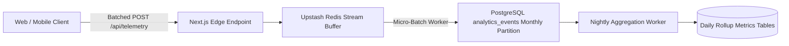

# TUKUBI Analytics Subsystem Architecture

**Status:** Production Ready  
**Version:** September 2026 Master Baseline  

---

## 1. Privacy-Preserving Telemetry Taxonomy

TUKUBI implements a privacy-by-design telemetry system adhering to Caribbean Data Protection Acts (Barbados, Jamaica, Trinidad & Tobago, Bahamas) and international GDPR standards.

- **Zero PII Collection:** Telemetry events never record IP addresses, email addresses, raw phone numbers, or unredacted user input.
- **Event Schema:**
  - `event_name` (e.g., `post_viewed`, `sound_played`, `product_purchased`, `creator_tipped`)
  - `user_id` (Pseudonymous UUID, null for anonymous visitors)
  - `entity_id` (Target object UUID)
  - `country_code` (ISO 3166-1 alpha-2, user-selected Caribbean country or diaspora region)
  - `properties` (Sanitized JSONB payload: viewport, duration_ms, referer)
  - `created_at` (Partition key TIMESTAMPTZ)

---

## 2. Ingestion & Partitioned Storage Engine

- **Partition Pruning:** Ingestion routes directly to the current month's partition (`analytics_events_2026_09`).
- **Cold Data Archival:** Partitions past 180 days can be detached and archived to compressed Parquet files in cold storage without locking the primary table.
- **Access Control:** `analytics_events` tables are strictly readable by `service_role` and members of `admin_roles`.

---

## 3. Pre-Aggregated Rollup Metrics

To prevent expensive analytical aggregate scans over millions of raw events during dashboard rendering:
- **`user_daily_metrics`:** Pre-computed daily engagement stats (post impressions, reactions received, profile visits) powering `apps/creator-studio`.
- **`business_daily_metrics`:** Aggregated page views, listing clicks, and order volume powering `apps/business-studio`.
- **`platform_daily_metrics`:** High-level platform KPIs (MAU, DAU, transaction volume) powering `apps/admin`.
