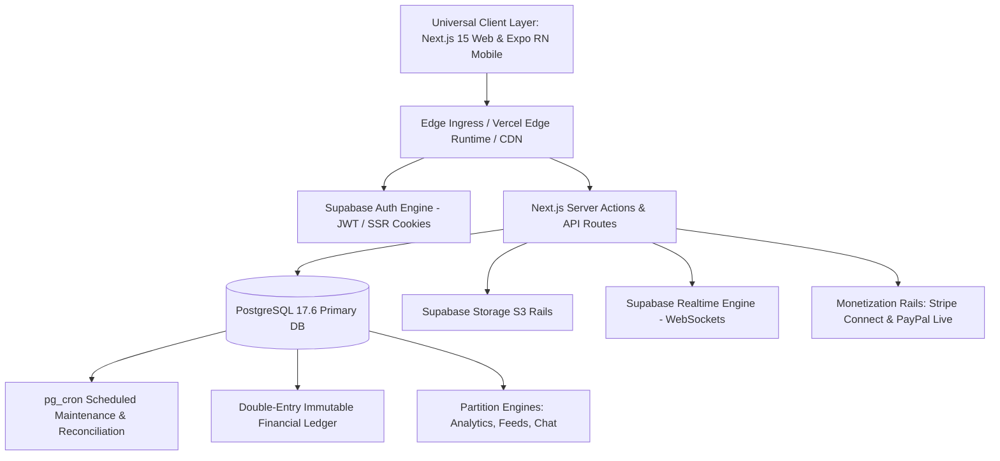

# TUKUBI System Architecture & Infrastructure Blueprint

**Status:** Production Ready  
**Version:** September 2026 Master Baseline  
**Platform Ref:** `qixlaqwohhrynownvqwp` (Supabase Cloud, AWS us-east-1)  
**Database Engine:** PostgreSQL 17.6 on x86_64-pc-linux-gnu  
**Web Application:** Next.js 15.5.23 App Router, React 19, Tailwind CSS  
**Mobile Application:** Universal Expo 52 React Native (iOS, Android, Web)  

---

## 1. System Philosophy & Caribbean Futurism Identity

TUKUBI ("The Caribbean Connected") is the digital infrastructure uniting the Caribbean basin and its global diaspora across North America, the UK, Europe, and Latin America.

TUKUBI is **not** a generic social clone. It integrates:
- **Bespoke Social Relationships:** Strict separation of bilateral friendships, asymmetrical creator following, and hub memberships.
- **Multilingual Diaspora Routing:** Automatic dialect and language localization across English, Spanish, French, Haitian Creole, and Papiamentu.
- **Unified Entity Governance:** Symmetric lifecycles (`CREATE` → `USE` → `MANAGE` → `EDIT` → `ARCHIVE` → `DELETE`) across Pages (Businesses), Communities (Guilds/Hubs), Events, and Marketplace Listings.
- **Double-Entry Financial Integrity:** Atomic ledger settlement with zero mutable balance increments.
- **Caribbean Sounds & Media Pipeline:** Standardized aspect ratios (`9:16`, `1:1`, `4:5`, `16:9`), verified licensing metadata, and low-latency live streaming.



---

## 2. Tiered Monorepo Topology

The repository is structured as a Turborepo monorepo encompassing 31 distinct applications and packages:

```
social-media-platform/
├── apps/
│   ├── web/                    (Next.js 15.5.23 App Router — 100+ routes)
│   ├── mobile/                 (Expo 52 Universal React Native — iOS/Android)
│   ├── admin/                  (Next.js 15.5.23 — Platform Operator Console)
│   ├── moderation/             (Next.js 15.5.23 — Trust & Safety Operations)
│   ├── creator-studio/         (Next.js 15.5.23 — Creator Analytics & Payouts)
│   └── business-studio/        (Next.js 15.5.23 — Storefront & Inventory Management)
└── packages/
    ├── advertising/            (Self-serve ads & delivery engine)
    ├── ai/                     (CaribAI OpenRouter free-model inference & risk scoring)
    ├── analytics/              (Privacy-preserving event taxonomy & telemetry)
    ├── api/                    (Typed RPC contracts & data interfaces)
    ├── auth/                   (Supabase SSR cookie sessions & auth guards)
    ├── business/               (Commerce, organizations & enterprise RBAC)
    ├── communities/            (Hubs, island channels & community roles)
    ├── creator/                (Monetization rules, tiers, payouts)
    ├── database/               (Typed Supabase schema definitions)
    ├── design-system/          (Island Vibes tokens, gradients, animations)
    ├── jobs/                   (Background task runners & schedulers)
    ├── live/                   (RTMP/WebRTC room state & stream tokens)
    ├── localization/           (Multi-lingual translation & cultural strings)
    ├── marketplace/            (Social commerce engine & order state machine)
    ├── media/                  (Media ingest, transcoding, aspect ratios)
    ├── messaging/              (Messenger-grade WebSocket conversations & cards)
    ├── notifications/          (Multi-channel push & preference matrix)
    ├── payments/               (Double-entry ledger & multi-provider rails)
    ├── podcasts/               (RSS syndication & episode playback)
    ├── recommendations/        (Affinity graph, PYMK, content ranking)
    ├── sdk/                    (Developer SDK & platform client)
    ├── search/                 (PostgreSQL Trigram & Full-Text Search)
    ├── social/                 (Social graph, posts, reactions, comments)
    ├── trust-safety/           (Risk engine, moderation appeals, case queue)
    └── ui/                     (Shared React & Tailwind v4 components)
```

---

## 3. Data Flow & Security Boundaries

1. **Client Authorization:** Client-side state is strictly for UI feedback. All data access is governed by:
   - PostgreSQL Row Level Security (RLS) on all 208 public tables and partitions.
   - Server-side Next.js Server Actions executing with authenticated Supabase SSR clients.
   - Service-role isolation for privileged background workers, webhooks, and maintenance tasks.
2. **Double-Entry Financial Accounting:** Every monetary event creates balanced credit/debit records referencing immutable ledger accounts. Mutable column increments (`balance = balance + X`) are strictly forbidden.
3. **Media Pipeline:** All media uploads enforce MIME-type whitelisting, byte limits, user-scoped folder paths (`(storage.foldername(name))[1] = auth.uid()`), and responsive thumbnail transformations.
