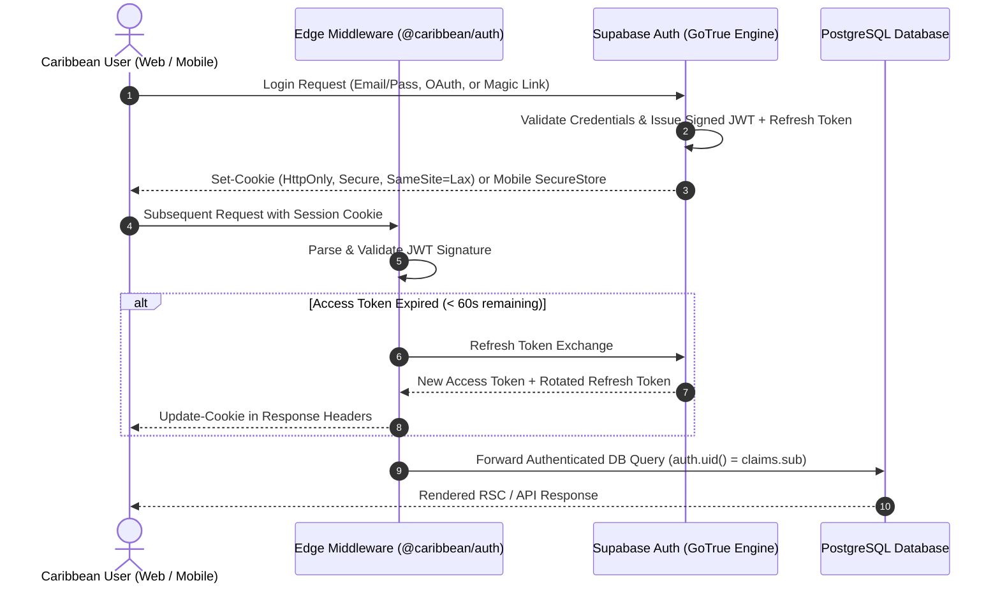

# TUKUBI Authentication Architecture & Session Management

**Status:** Production Ready  
**Version:** September 2026 Master Baseline  

---

## 1. Authentication Topology & Protocols

TUKUBI leverages Supabase Auth backed by GoTrue and PostgreSQL, integrated deeply into the Next.js 15 App Router (`@caribbean/auth`) and Universal Expo React Native mobile apps.

---

## 2. Session Management & Storage Strategy

### 2.1 Next.js 15 Web Application
- **Zero LocalStorage Tokens:** To prevent XSS extraction, JWTs are never stored in browser `localStorage` or `sessionStorage`.
- **`@supabase/ssr` Cookie Protocol:** Handled via chunked cookies (`sb-<project-ref>-auth-token.0`, `.1`) configured with:
  - `HttpOnly: true`
  - `Secure: true` (enforced in production HTTPS)
  - `SameSite: Lax`
  - `Path: /`
- **RSC & Server Actions Hydration:** Server Components retrieve session claims via `createClient()` from `@caribbean/auth/server`, injecting the active user ID into Postgres RLS contexts without client round-trips.

### 2.2 Expo Mobile Application (iOS & Android)
- **`expo-secure-store`:** Tokens are encrypted in the hardware-backed iOS Keychain and Android KeyStore.
- **Biometric Authentication:** FaceID / TouchID / Android Biometrics guard sensitive wallet transactions and payout requests.
- **Apple Sign-In Compliance:** In accordance with App Store Review Guidelines Section 4.8, Apple Sign-In is supported natively alongside Google Sign-In and email authentication.

---

## 3. Account Provisioning Lifecycle

When a new user successfully authenticates for the first time, PostgreSQL triggers `public.handle_new_user()` atomically:

1. **Profile Initialization:** Extracts `raw_user_meta_data`, assigns username, country origin, display name.
2. **User Settings Configuration:** Defaults language to user preference (en, es, fr, ht, pap) and configures notification channels.
3. **Double-Entry Ledger Account Creation:** Provisons a dedicated liability account in `public.ledger_accounts`.
4. **Platform Wallet Link:** Creates row in `public.wallets` referencing the user's ledger account with an initial zero balance.
5. **Audit Event:** Emits telemetry event recording user registration source.

If any provisioning step fails, the entire transaction rolls back, preventing orphaned auth records.
