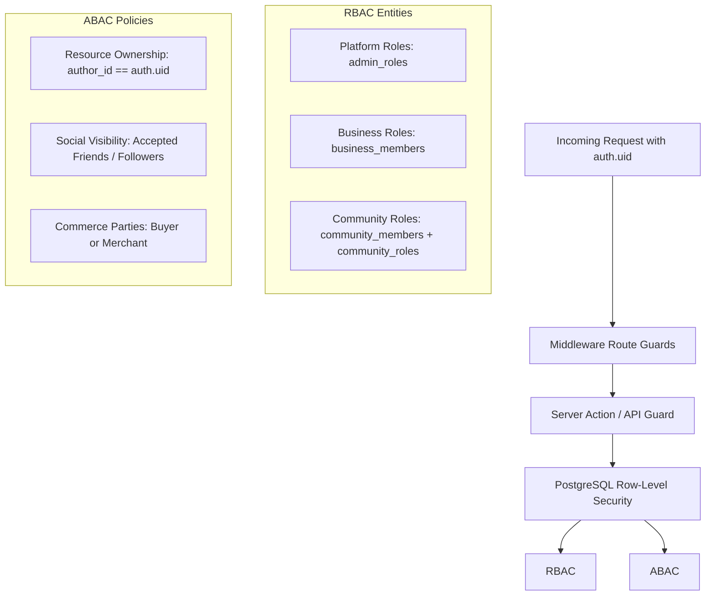

# TUKUBI Authorization & Access Control Architecture

**Status:** Production Ready  
**Version:** September 2026 Master Baseline  

---

## 1. Multi-Tiered Access Control Model

TUKUBI combines **Role-Based Access Control (RBAC)** for organizational and administrative domains with **Attribute-Based Access Control (ABAC)** for personal resources and creator content.

---

## 2. RBAC Hierarchies

### 2.1 Platform Administration (`admin_roles`)
Enforced in `apps/admin` and high-privilege RPCs:
- **`superadmin`:** Complete platform visibility, feature flag management, financial ledger audits, system migrations.
- **`moderator`:** Trust & safety case processing, content removal, user warnings, temporary bans.
- **`finance_auditor`:** View-only access to double-entry ledger accounts, reconciliation reports, and payout audit queues.
- **`support_agent`:** Customer service ticket review and non-destructive profile assistance.

### 2.2 Business / Page Hierarchy (`business_members`)
Enforced for Caribbean merchants and organizations:
| Role | Manage Team | Edit Business Profile | Manage Marketplace Products | Fulfill Orders | View Analytics |
| :--- | :---: | :---: | :---: | :---: | :---: |
| **`owner`** | Yes | Yes | Yes | Yes | Yes |
| **`admin`** | Yes | Yes | Yes | Yes | Yes |
| **`editor`** | No | Yes | Yes | No | Yes |
| **`moderator`**| No | No | No | No (Reply Reviews Only)| No |
| **`analyst`** | No | No | No | No | Yes (Read-Only) |

### 2.3 Community / Guild Hierarchy (`community_roles` & `community_members`)
Community authorization is decoupled via dynamic permission sets in `public.community_roles` linked by `community_members.role_id`:
- **`can_manage_roles`:** Promote/demote members.
- **`can_manage_settings`:** Modify community metadata, rules, and privacy tiers (public, private, secret).
- **`can_manage_channels`:** Create, archive, and lock topic channels.
- **`can_moderate`:** Remove posts, review join requests, mute/ban members.
- **`can_post`:** Standard posting privileges in channels.

---

## 3. ABAC Resource Ownership Rules

1. **Content Mutability:** A post, comment, or media asset may only be updated or deleted by its original author (`author_id = auth.uid()`), unless acted upon by a designated community moderator (within that community) or a platform moderator.
2. **Commerce Contracts:** An order line item or dispute record can only be inspected or updated if the caller is the registered buyer (`buyer_id = auth.uid()`) or an authorized member of the selling business.
3. **Private Direct Messaging:** Conversation history is strictly restricted to active participants registered in `public.conversation_participants` where `left_at IS NULL`.
