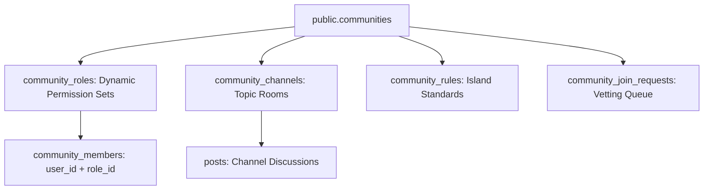

# TUKUBI Communities & Guilds Subsystem Architecture

**Status:** Production Ready  
**Version:** September 2026 Master Baseline  

---

## 1. Cultural Guilds & Island Hubs Architecture

Communities in TUKUBI are designed as persistent digital gathering spaces ("Guilds" or "Hubs") connecting Caribbean nationals and the diaspora around shared island heritage, music, festivals, technology, and regional interests.



---

## 2. Granular Role Architecture & Membership Schema

Unlike simplistic platforms with hardcoded role enums, TUKUBI implements dynamic, decoupled community roles via `public.community_roles`:

- **Schema Relationship:** `community_members` does **not** use a raw string role column. It enforces a strict foreign key link:
  ```sql
  community_members.role_id UUID REFERENCES community_roles(id) ON DELETE RESTRICT
  ```
- **Default Seed Roles:** Seeded automatically upon community creation via the `seed_default_community_roles` RPC:
  - `Owner` (`is_owner = true`, all permissions enabled)
  - `Admin` (management of channels, settings, roles, moderation)
  - `Moderator` (`can_moderate = true`: handle join requests, remove violating content, warn members)
  - `Member` (standard posting and participation)

---

## 3. Privacy & Discovery Tiers

1. **`public`:** Visible in discovery search, joinable instantly by any authenticated user. Content readable by the public.
2. **`private`:** Visible in search. Joining requires submitting a request to `community_join_requests` reviewed by moderators. Content visible only to active members.
3. **`secret`:** Completely invisible in search and discovery. Membership strictly via direct invitation from an existing administrator.

---

## 4. Topic Channels & Realtime Discussion

Each community contains multiple focused topic channels (`community_channels`):
- Channels can be configured with specific posting permissions (e.g., Announcements channel restricted to Admins; General Discussion open to all members).
- Channel posts leverage standard `posts` entities with `community_id` and `channel_id` foreign keys, inheriting community RLS policies automatically.
