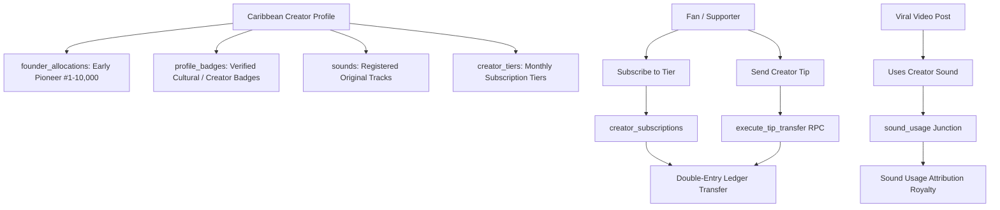

# TUKUBI Creator Economy Subsystem Architecture

**Status:** Production Ready  
**Version:** September 2026 Master Baseline  

---

## 1. Caribbean Creator Monetization Architecture

TUKUBI provides a native monetization infrastructure tailored to Caribbean artists, musicians, filmmakers, cultural ambassadors, and digital creators.

---

## 2. Founder Allocations & Pioneer Numbering

To celebrate early adopters, community leaders, and pioneer artists, TUKUBI allocates exclusive Pioneer Founder Numbers:
- **Registry:** `public.founder_allocations` stores immutable mappings between `user_id` and sequential founder numbers (1 to 10,000).
- **Issuance Security:** Numbers are issued exclusively via the `allocate_founder_number(target_user_id, founder_no)` RPC, which is locked strictly to `service_role`.
- **UI Presentation:** Displays on creator profiles and comments with an Island Sunset gradient badge.

---

## 3. Caribbean Sounds & Usage Attribution

Musicians and producers can register original stems and mastered tracks in `public.sounds`:
- **Categorization:** Tagged by authentic Caribbean genre (Soca, Reggae, Dancehall, Kompa, Calypso, Zouk, Bouyon, Steelpan).
- **Atomic Attribution:** When creators select a sound for short-form video posts, a row is inserted in `public.sound_usage`.
- **Counter Synchronization:** A database trigger (`sync_sound_usage_count`) atomically maintains `sounds.usage_count` without race conditions.
- **Audio Fingerprint Protection:** Audio files undergo waveform analysis and format normalization via FFmpeg before indexing.

---

## 4. Subscriptions, Tipping & Payout Workflows

- **Creator Tiers:** Creators configure multi-tier memberships (`creator_tiers`) defining monthly price and subscriber perks (exclusive posts, subscriber-only chat channels).
- **Tips:** Fans send instant monetary tips via `execute_tip_transfer` RPC, transferring funds directly between platform ledger accounts with zero latency.
- **Payouts:** Creators initiate withdrawals to their linked Stripe Connect account or PayPal wallet once meeting threshold requirements.
