# TUKUBI Database Dependency Graph & Entity Relationships

**Status:** Production Baseline  
**Version:** September 2026 Master Baseline  

---

## 1. Topological Entity Hierarchy

The database follows a strict directed acyclic graph (DAG) of entity ownership and referential integrity. Deletions and updates flow downstream through clearly designated referential actions:
- **`ON DELETE CASCADE`:** Permitted only for child owned sub-entities (e.g., `post_media` cascade-deleted when parent `post` is deleted; `conversation_participants` cascade-deleted when parent `conversation` is deleted).
- **`ON DELETE RESTRICT` / `NO ACTION`:** Mandated for all legal, audit, financial, and contractual records (e.g., `ledger_entries` cannot be deleted if a user is deleted; `marketplace_orders` cannot be cascaded).
- **`ON DELETE SET NULL`:** Used for historical attributions where author profile is deleted but entity remains (e.g., `moderation_actions.moderator_id`).

```mermaid
graph TD
    AuthUser[auth.users] --> Profile[public.profiles]
    Profile --> Settings[user_settings]
    Profile --> Wallets[wallets]
    Profile --> LedgerAcc[ledger_accounts]
    Profile --> Devices[user_devices]
    Profile --> Posts[posts]
    Profile --> Comments[comments]
    Profile --> BusMembers[business_members]
    Profile --> CommMembers[community_members]
    Profile --> MarketListings[marketplace_listings]
    Profile --> OrdersBuyer[marketplace_orders: buyer]
    
    Bus[public.businesses] --> BusMembers
    Bus --> MarketListings
    Bus --> BusHours[business_hours]
    Bus --> BusReviews[business_reviews]
    
    Comm[public.communities] --> CommRoles[community_roles]
    CommRoles --> CommMembers
    Comm --> CommChannels[community_channels]
    Comm --> CommRules[community_rules]
    
    Posts --> PostMedia[post_media]
    Posts --> Comments
    Posts --> PostReactions[post_reactions]
    Posts --> FeedTimeline[feed_activity_timeline]
    
    Sounds[public.sounds] --> SoundUsage[sound_usage]
    Posts --> SoundUsage
    
    Conversations[public.conversations] --> ConvParts[conversation_participants]
    Conversations --> ChatMessages[chat_messages partitioned]
    ChatMessages --> MsgAtt[message_attachments]
    ChatMessages --> MsgRec[message_receipts]
    ChatMessages --> MsgReact[message_reactions]
    
    LedgerAcc --> LedgerTx[ledger_transactions]
    LedgerTx --> LedgerEntries[ledger_entries]
    
    MarketListings --> OrderItems[order_items]
    OrdersBuyer --> OrderItems
    OrdersBuyer --> CarrierTracking[carrier_tracking_events]
    OrdersBuyer --> Disputes[disputes]
```

---

## 2. Cross-Schema Dependencies

### 2.1 `auth` Schema → `public` Schema
- `public.profiles.id` references `auth.users(id)` ON DELETE CASCADE.
- Trigger: `public.handle_new_user()` executes `AFTER INSERT ON auth.users` under `SECURITY DEFINER` privileges to:
  1. Initialize `public.profiles` row with extracted metadata.
  2. Initialize `public.user_settings` with default regional and privacy preferences.
  3. Create liability account in `public.ledger_accounts` for user's platform balance.
  4. Initialize `public.wallets` row linking to the ledger account.

### 2.2 `storage` Schema ↔ `public` Schema
- `public.media_assets` stores reference URIs to files in `storage.objects`.
- Storage RLS policies in `storage.objects` query `public.profiles`, `public.business_members`, and `public.community_members` to verify bucket and folder authorization (`(storage.foldername(name))[1] = auth.uid()::text`).

---

## 3. Trigger Execution Cascades & Invariant Enforcement

| Trigger Name | Source Entity | Target Action | Security / Invariant Enforced |
| :--- | :--- | :--- | :--- |
| `trg_on_auth_user_created` | `auth.users` | Insert `profiles`, `wallets`, `user_settings` | Guarantees 100% profile existence for any authenticated session. |
| `trg_update_timestamp` | Multiple (all core tables) | Update `updated_at` | Automatic UTC timestamp synchronization. |
| `trg_enforce_ledger_immutability` | `ledger_entries`, `ledger_transactions` | Abort `UPDATE` / `DELETE` | Enforces double-entry append-only accounting. |
| `trg_sync_sound_usage` | `posts` | Increment / Decrement `sounds.usage_count` | Atomic attribution metrics for Caribbean sound creators. |
| `trg_audit_admin_action` | `moderation_actions`, `business_verifications` | Append to `audit_logs` | Immutable audit trail for compliance and safety. |
| `trg_partition_routing` | `chat_messages` | Route to `chat_messages_p[0-7]` | Hash distribution on `conversation_id`. |
