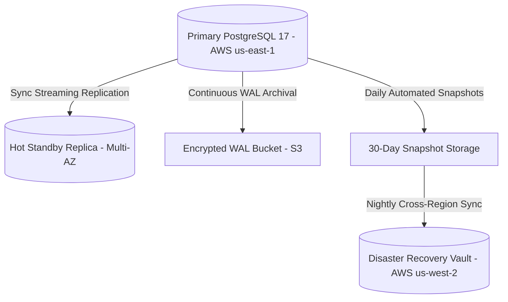

# TUKUBI Disaster Recovery & High Availability Runbook

**Status:** Production Ready  
**Version:** September 2026 Master Baseline  

---

## 1. RPO & RTO Disaster Recovery Targets

Given the Caribbean region's susceptibility to severe climate events (hurricanes, regional fiber breaks) and the financial criticality of the double-entry ledger, TUKUBI targets stringent continuity standards:

- **Recovery Point Objective (RPO):** $< 60\text{ seconds}$ (Continuous Write-Ahead Log / WAL stream replication).
- **Recovery Time Objective (RTO):** $< 15\text{ minutes}$ (Automated standby instance promotion and DNS failover).

---

## 2. Backup Topology & Data Protection

1. **Continuous PITR (Point-in-Time Recovery):** Write-Ahead Logs are continuously streamed to encrypted object storage, allowing restoration down to the exact second of an incident.
2. **Automated Daily Base Backups:** Full database image snapshots are captured daily at 03:00 UTC and preserved for 30 days.
3. **Double-Entry Ledger Invariance Assertion:** Following any restore procedure, `public.reconciliation_reports` verification is executed immediately before unfreezing write traffic.

---

## 3. Incident Recovery Runbooks

### 3.1 Unscheduled Primary Node Failure
1. AWS RDS / Supabase Control Plane detects loss of primary heartbeat ($t > 30\text{s}$).
2. Hot standby replica in alternate Availability Zone is promoted to primary.
3. Virtual IP / connection pooler endpoints reroute active connections automatically.
4. Total expected downtime: $\approx 60\text{–}120\text{ seconds}$.

### 3.2 Accidental Table Data Corruption / Malicious Modification
1. Identify the exact timestamp $T$ immediately prior to the corrupting event.
2. Initiate Point-In-Time-Recovery (PITR) to a temporary restoration instance targeting $T - 1\text{s}$.
3. Verify integrity of the double-entry financial ledger and user data on the temporary instance.
4. Export affected tables via `pg_dump` and restore into primary using transaction-safe upserts.
5. Re-run reconciliation suite to confirm zero ledger discrepancies.
