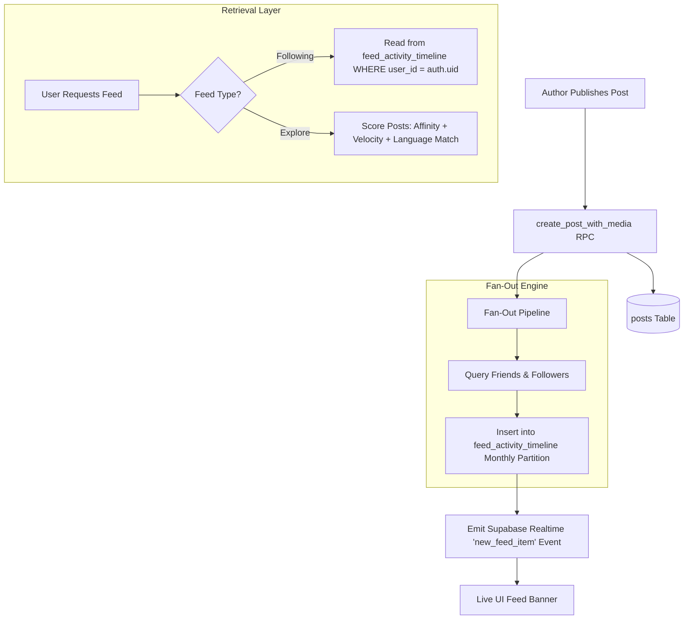

# TUKUBI Feeds Subsystem Architecture

**Status:** Production Ready  
**Version:** September 2026 Master Baseline  

---

## 1. Dual-Feed Topology

TUKUBI provides two distinct feed experiences engineered to celebrate Caribbean culture while delivering low latency:

1. **Chronological "Island Flow" (Following Feed):** Pure reverse-chronological timeline of posts from bilateral friends, followed creators, and joined community hubs.
2. **Algorithmic "Caribbean Discovery" (Explore Feed):** Regional affinity-weighted discovery showcasing trending Caribbean sounds, viral festival moments, diaspora discussions, and verified local businesses.



---

## 2. Partitioned Activity Timeline Schema

To avoid massive join penalties across millions of friendship edges at read time, following timelines utilize a fan-out-on-write timeline architecture stored in `feed_activity_timeline`, range partitioned monthly (`feed_activity_timeline_2026_08`, `2026_09`, `2026_10`, etc.):

- **Index Optimization:** Each partition maintains an index on `(user_id, created_at DESC)`.
- **Read Performance:** Querying the user's following feed requires a single indexed scan on the current month partition:
  ```sql
  SELECT p.*, fat.created_at as activity_at
  FROM feed_activity_timeline fat
  JOIN posts p ON p.id = fat.post_id
  WHERE fat.user_id = auth.uid()
  ORDER BY fat.created_at DESC
  LIMIT 20;
  ```
- **Celebrity Fan-Out Guard:** Users with >10,000 followers use a hybrid fan-out model (inlined at read time) to prevent write amplification.

---

## 3. Caribbean Multilingual & Dialect Routing

Content discovery dynamically adapts to the user's selected cultural settings in `public.user_settings`:
- **Supported Dialects & Languages:** English (regional Caribbean varieties), Spanish (Dominican, Puerto Rican, Cuban), French & Antillean Creole (Guadeloupe, Martinique), Haitian Creole, and Papiamentu (Aruba, Curaçao, Bonaire).
- **Affinity Scoring:** Content with matching regional language tags or originating from the user's home or diaspora territory receives an affinity boost in the discovery ranking matrix.
