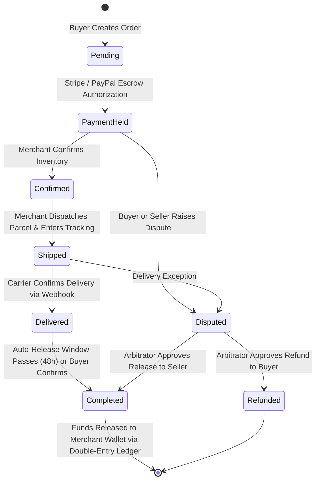

# TUKUBI Social Marketplace Subsystem Architecture

**Status:** Production Ready  
**Version:** September 2026 Master Baseline  

---

## 1. Regional Social Commerce Engine

The TUKUBI Marketplace powers cross-border and inter-island commerce across the Caribbean basin and the global diaspora. It seamlessly unites social discovery with secure escrow fulfillment.

---

## 2. Relational Schema & Order Entities

- **`marketplace_listings`:** Product catalog with title, description, category, price, currency (USD, XCD, JMD, TTD, BBD, EUR, GBP), inventory count, shipping regions, and media photos.
- **`marketplace_orders`:** High-level order transaction recording `buyer_id`, `merchant_business_id`, total amount, currency, escrow state, and shipping details.
- **`order_items`:** Line-item snapshots capturing the unit price, quantity, and product snapshot at time of purchase.
- **`carrier_tracking_events`:** Ingested parcel telemetry via `ingest_carrier_tracking_event` tracking package movement across Caribbean maritime/air couriers and international carriers (DHL, FedEx, Laparkan, Caribbean Airlines Cargo).
- **`disputes`:** Evidence repository for order disagreements, capturing claim reason, photo evidence, and platform moderation ruling.

---

## 3. Escrow Settlement & Double-Entry Ledger Integration

To protect buyers against non-delivery and merchants against fraudulent chargebacks:
1. **Hold Phase:** When payment is authorized, funds are credited to the platform escrow liability account (`escrow_pending`).
2. **Release Phase:** Upon confirmed delivery, a balanced double-entry transaction debits `escrow_pending`, credits `merchant_wallet_liability`, and credits `platform_revenue_fees` according to platform commission tiers.
3. **Refund Phase:** If a dispute resolves in favor of the buyer, the escrow liability is reversed, crediting the buyer's original payment method or wallet.
