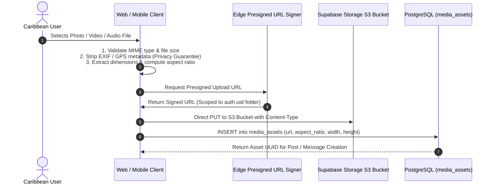

# TUKUBI Media Subsystem & Aspect Ratio Pipeline

**Status:** Production Ready  
**Version:** September 2026 Master Baseline  

---

## 1. Standardized Media Pipeline & Aspect Ratios

To deliver a visually cohesive Caribbean aesthetic without layout shifts, all visual media assets in TUKUBI conform to strictly enforced aspect ratios:

| Ratio | Geometry | Canonical Use Case | Container Class | Max Dimensions |
| :---: | :---: | :--- | :--- | :--- |
| **`9:16`** | Vertical | Short-form videos, stories, mobile-first reels | `aspect-[9/16]` | 1080 × 1920 px |
| **`1:1`** | Square | Profile avatars, album art, marketplace thumbnails | `aspect-square` | 1080 × 1080 px |
| **`4:5`** | Portrait | High-impact social feed posts and photography | `aspect-[4/5]` | 1080 × 1350 px |
| **`16:9`**| Landscape | Live stream broadcasts, landscape video replays | `aspect-video` | 1920 × 1080 px |

---

## 2. Ingest Architecture & Privacy Pipeline

---

## 3. Privacy Preservation & EXIF Sanitization

In accordance with TUKUBI Privacy Mandates (`RULE[AGENTS.md]`):
- **EXIF Stripping:** All GPS coordinates, device serial numbers, camera model data, and exposure timestamps are stripped in the client browser / mobile sandbox before upload.
- **Path Isolation:** Files are stored in user-isolated paths (`{bucket}/{user_id}/{uuid}.{ext}`).
- **MIME Whitelisting:** Allowed upload types are strictly restricted to `image/jpeg`, `image/png`, `image/webp`, `image/avif`, `video/mp4`, `video/quicktime`, `audio/mpeg`, `audio/aac`, and `audio/wav`.
