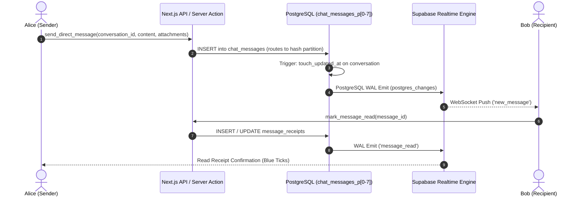

# TUKUBI Messaging Subsystem Architecture

**Status:** Production Ready  
**Version:** September 2026 Master Baseline  

---

## 1. High-Concurrence Messaging Architecture

TUKUBI's messaging infrastructure provides low-latency direct, group, merchant, and community chat across web and mobile.



---

## 2. Hash Partitioning (`chat_messages_p0` .. `p7`)

Messages are distributed horizontally across 8 hash partitions based on `conversation_id`:

- **Write Isolation:** Writes across different conversations never lock or contend with each other.
- **Single Bucket Scanning:** All messages for a given conversation reside in the exact same partition bucket, maximizing index buffer cache hit ratios.
- **Partition RLS Enforcement:** Migration `00093` established explicit RLS policies on each partition:
  ```sql
  CREATE POLICY "Participants can read messages p0"
  ON public.chat_messages_p0 FOR SELECT
  USING (is_conversation_participant(conversation_id, auth.uid()));
  ```

---

## 3. Ephemeral Realtime Features

To maintain minimal database overhead, ephemeral chat states bypass table persistence and utilize Supabase Realtime Broadcast & Presence channels:

1. **Typing Indicators:** Broadcast over `realtime:conversation:{id}` channel with a 3-second auto-expiry timeout.
2. **Presence & Online Status:** Evaluated via WebRTC / WebSocket heartbeat, respecting the user's privacy preference (`hide_online_status`).
3. **Voice Notes:** Encoded as AAC / Opus audio with client-side waveform extraction stored as 64-point amplitude vectors in `message_attachments.metadata`.

---

## 4. Multi-Entity Interactive Message Cards

Conversations support rich interactive structured payloads:
- **Marketplace Order Cards:** Inlines product photo, price in Eastern Caribbean Dollars (XCD), US Dollars (USD), or Jamaican Dollars (JMD), and live shipping tracking button.
- **Sound Clip Previews:** Inline 30-second Caribbean audio snippets with playback controls.
- **Island Location Pins:** Geocoded coordinates with interactive maps for local meeting points.
