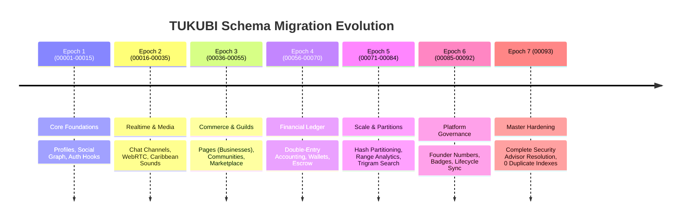

# TUKUBI Migration Archaeology & Evolution History

**Status:** Synchronized & Audited  
**Version:** September 2026 Master Baseline  
**Total Registered Migrations:** 94 (`00001` through `00093`)  
**Tracking Table:** `supabase_migrations.schema_migrations`  

---

## 1. Migration Epochs & Chronology

---

## 2. Detailed Era Breakdown

### Epoch 1: Core Social Foundations (`00001` – `00015`)
- Established base PostgreSQL extensions (`uuid-ossp`, `pgcrypto`).
- Created core user tables: `profiles`, `user_settings`, `relationships` (bilateral friends vs creator follows).
- Established `posts`, `comments`, and `post_reactions` with fundamental RLS policies.
- Implemented `handle_new_user()` trigger for automated profile generation on auth.

### Epoch 2: Realtime Messaging & Caribbean Media Pipeline (`00016` – `00035`)
- Introduced `conversations` and `conversation_participants`.
- Added WebRTC call session tables (`call_sessions`, `call_participants`).
- Deployed Caribbean Sound library schema (`sounds`, `sound_usage`) supporting regional genres (Soca, Reggae, Dancehall, Kompa, Calypso, Zouk).
- Integrated `media_assets` with aspect ratio verification (`9:16`, `1:1`, `4:5`, `16:9`).

### Epoch 3: Pages, Communities & Marketplace (`00036` – `00055`)
- Implemented Business / Page architecture: `businesses`, `business_members`, `business_hours`, `business_reviews`.
- Deployed Community Hubs: `communities`, `community_roles`, `community_channels`, `community_members`.
- Built Social Commerce: `marketplace_listings`, `marketplace_orders`, `order_items`, `carrier_tracking_events`.

### Epoch 4: Double-Entry Financial Ledger (`00056` – `00070`)
- Replaced all mutable counter concepts with NASA-grade immutable double-entry accounting.
- Deployed `ledger_accounts`, `ledger_transactions`, `ledger_entries`, `wallets`.
- Created atomic balance assertion triggers preventing overdrafts or unbalanced transactions.
- Implemented payout request pipelines for Stripe Connect and PayPal rails.

### Epoch 5: High-Performance Partitioning & Discovery (`00071` – `00084`)
- Converted `chat_messages` to 8 hash partitions on `conversation_id`.
- Converted `analytics_events` and `feed_activity_timeline` to monthly range partitions.
- Introduced `pg_trgm` fuzzy search indexing across profiles, businesses, and marketplace listings.

### Epoch 6: Governance, Founder Numbers & Lifecycle (`00085` – `00092`)
- Applied September 2026 updates reconciling database with recent frontend features.
- Added `founder_allocations` for the first 10,000 Caribbean pioneers.
- Integrated `profile_badges` and identity verification workflows.
- Harmonized lifecycle states across all major entities (`CREATE` → `USE` → `MANAGE` → `EDIT` → `ARCHIVE` → `DELETE`).

### Epoch 7: Master Production Infrastructure Hardening (`00093`)
- **Resolved all Supabase Advisor Security & Performance findings:**
  - Dropped 7 duplicate indexes and 1 redundant index.
  - Relocated `pg_trgm` extension from `public` to `extensions`.
  - Added explicit `SET search_path = public` on mutable functions.
  - Revoked `EXECUTE` on 27 internal triggers from `PUBLIC`, `anon`, and `authenticated`.
  - Revoked `EXECUTE` from `anon` on all remaining sensitive RPCs; locked administrative RPCs to `service_role`.
  - Established explicit RLS policies across all 28 partitions and internal tables.
- Synchronized and registered on remote database `qixlaqwohhrynownvqwp`.

---

## 3. Deployment Safety Protocol

All migrations must adhere to the following rules:
1. Every migration must be strictly idempotent (`IF NOT EXISTS`, `OR REPLACE`).
2. Foreign key additions must be accompanied by explicit B-tree indexes.
3. Schema alterations must maintain backward compatibility with current running client versions.
4. Migrations are executed via the authenticated runner script (`scripts/apply-all-migrations.js`) communicating directly with the Supabase Management API.
