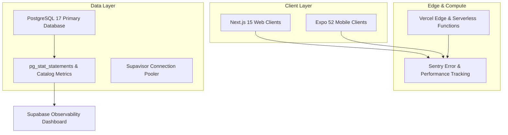

# TUKUBI Monitoring & Observability Architecture

**Status:** Production Ready  
**Version:** September 2026 Master Baseline  

---

## 1. Observability Stack Topology



---

## 2. Key Performance Indicators & SLAs

| Metric | Target SLA | Warning Threshold | Critical P0 Threshold |
| :--- | :--- | :--- | :--- |
| **API / Server Action P95** | < 120 ms | > 300 ms | > 800 ms |
| **Database Buffer Cache Hit Ratio** | > 99.0% | < 98.0% | < 95.0% |
| **Database Index Scan Ratio** | > 99.0% | < 95.0% | < 90.0% |
| **Realtime Message E2E Latency** | < 80 ms | > 250 ms | > 1000 ms |
| **Payment Settlement Success** | > 99.9% | < 99.0% | < 95.0% |
| **Web Vitals LCP (Largest Contentful Paint)**| < 1.8 s | > 2.5 s | > 4.0 s |

---

## 3. Database Health & Diagnostic Queries

Operational diagnostics executed via `pg_stat_statements` and internal catalog tables:

### 3.1 Buffer Cache Hit Ratio Inspection
```sql
SELECT 
  sum(heap_blks_hit) / (sum(heap_blks_hit) + sum(heap_blks_read)) * 100 AS cache_hit_ratio
FROM pg_statio_user_tables;
```

### 3.2 Slow Query Identification
```sql
SELECT 
  query, calls, total_exec_time / calls AS avg_exec_time_ms, rows
FROM pg_stat_statements
ORDER BY total_exec_time DESC
LIMIT 10;
```

### 3.3 Dead Tuple & Autovacuum Inspection
```sql
SELECT 
  relname, n_dead_tup, last_vacuum, last_autovacuum
FROM pg_stat_user_tables
ORDER BY n_dead_tup DESC
LIMIT 10;
```
