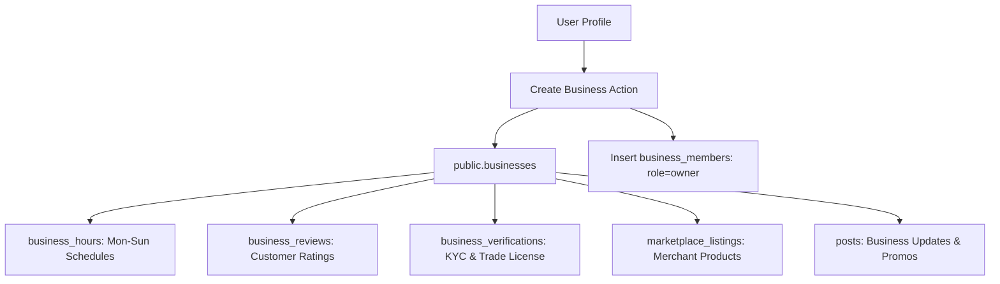

# TUKUBI Pages & Businesses Subsystem Architecture

**Status:** Production Ready  
**Version:** September 2026 Master Baseline  

---

## 1. Entity Architecture & Business Registry

In TUKUBI, Pages represent Caribbean enterprises, cultural institutions, tourism operators, culinary establishments, and verified brands. They are implemented via the `public.businesses` schema.



---

## 2. Multi-User Team Roles & Access Control

Access to Page administration is governed by `public.business_members`:

- **`owner`:** Full ownership, ability to delete page, transfer ownership, manage banking/payout settings.
- **`admin`:** Full day-to-day management: add/remove team members, publish posts, list products, respond to inquiries.
- **`editor`:** Content creator: create and edit posts, upload photos/videos, update business hours.
- **`moderator`:** Customer support: respond to customer reviews, reply to direct messages.
- **`analyst`:** Read-only access to visitor demographics, post performance, and order volume.

RLS policies verify business role membership using the security helper:
```sql
is_business_member(business_id, auth.uid(), ARRAY['owner', 'admin'])
```

---

## 3. Merchant Verification & Caribbean Trust

To safeguard diaspora commerce against fraud, TUKUBI incorporates a formal verification tier:
1. **Registered Entity Review:** Submission of national business registration, tax identification, or chamber of commerce credentials.
2. **Physical Island Verification:** Verification of local island address and operational phone.
3. **Verified Badge Display:** Awarded `verified_caribbean_business` badge rendered with official Island Gold shield styling.

---

## 4. Symmetric Lifecycle Implementation

Pages adhere to the platform's unified lifecycle specification:
- **CREATE:** Registration with auto-provisioning of owner role and default hours.
- **USE:** Publishing updates, interacting in comments, hosting live shopping events.
- **MANAGE:** Adding team members, reviewing financial ledger balances.
- **EDIT:** Modifying profile details, branding assets, hours of operation.
- **ARCHIVE:** Temporarily deactivating the page without deleting historical reviews or order records.
- **DELETE:** Soft-deletion marking `deleted_at = NOW()`, preserving financial and legal audit logs under referential integrity rules.
