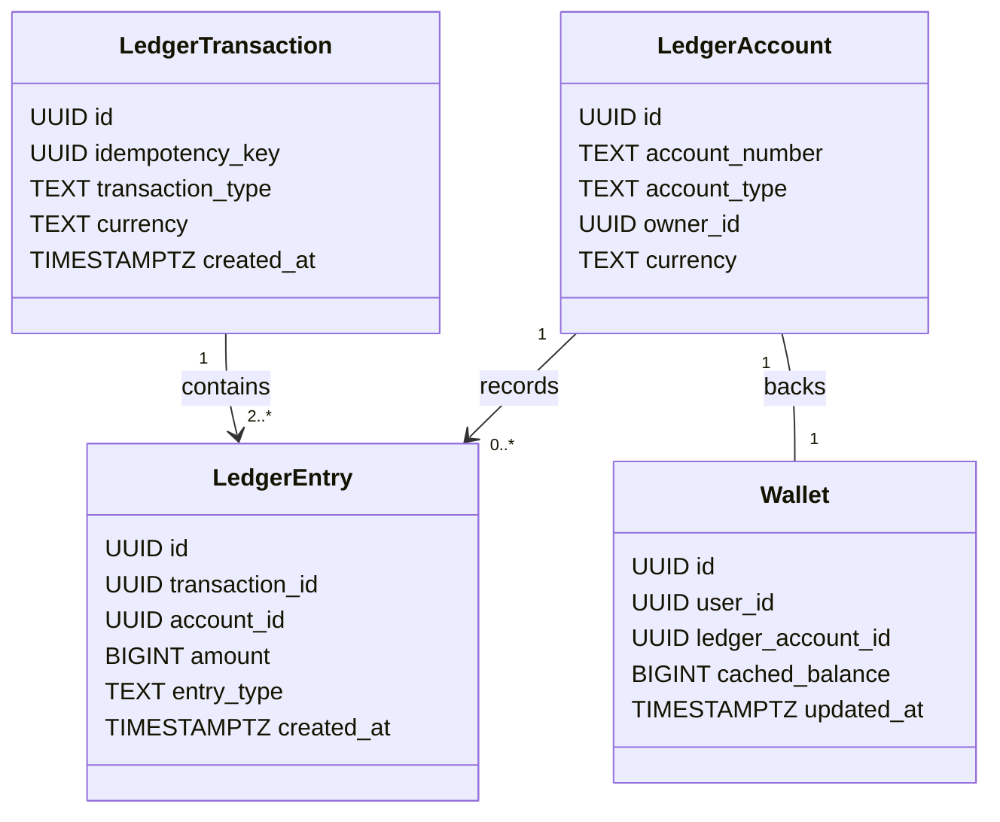

# TUKUBI Payments & Financial Ledger Architecture

**Status:** Production Ready  
**Version:** September 2026 Master Baseline  

---

## 1. Double-Entry Financial Accounting Ledger

TUKUBI enforces an immutable, NASA-grade double-entry ledger for all monetary movements across the platform. Mutable column increments (`UPDATE wallets SET balance = balance + X`) are strictly prohibited by engineering policy and database triggers.

---

## 2. Inviolable Financial Invariants

1. **Transaction Balance Invariant:** Every `ledger_transaction` must contain at least two `ledger_entries` such that:
   $$\sum \text{Debit Entries} = \sum \text{Credit Entries}$$
   This equality is asserted at the database level before commit.
2. **Append-Only Immutability:** Triggers on `ledger_entries` and `ledger_transactions` raise an exception on any attempt to execute an `UPDATE` or `DELETE` statement. Corrections must be executed as distinct reversal transactions.
3. **Idempotency Guarantees:** Every payment initiation requires a client-generated UUIDv4 `idempotency_key`. Repeating a request returns the previously recorded transaction result without creating duplicate ledger rows.

---

## 3. Supported Payment Rails & Provider Integration

TUKUBI routes payments strictly through world-class, compliant payment service providers:

- **Stripe Connect:** Used for merchant storefront checkout, subscription billing, and automated creator payouts to supported Caribbean and diaspora bank accounts.
- **PayPal Live:** Used for international diaspora payments and global PayPal wallet checkout.
- **Platform Wallet Balance:** Stored value held in trust, backed 1:1 by platform omnibus liability accounts. Users can utilize wallet balance for marketplace purchases, tips, and sound licensing.
- **Zero Prohibited Mechanisms:** No unauthorized or legacy third-party processors are permitted. All references are verified by automated CI checks (`pnpm check:prohibited`).

---

## 4. Automated Nightly Reconciliation Engine

The platform executes an automated financial reconciliation job nightly via `pg_cron`:
1. Scans all `ledger_accounts` and aggregates entry sums.
2. Asserts that the sum of all platform liabilities equals the verified cash held across Stripe, PayPal, and bank clearing accounts.
3. Generates a row in `public.reconciliation_reports`.
4. RLS security: `reconciliation_reports` is accessible strictly by `service_role` and members of the platform `finance_auditor` role.
