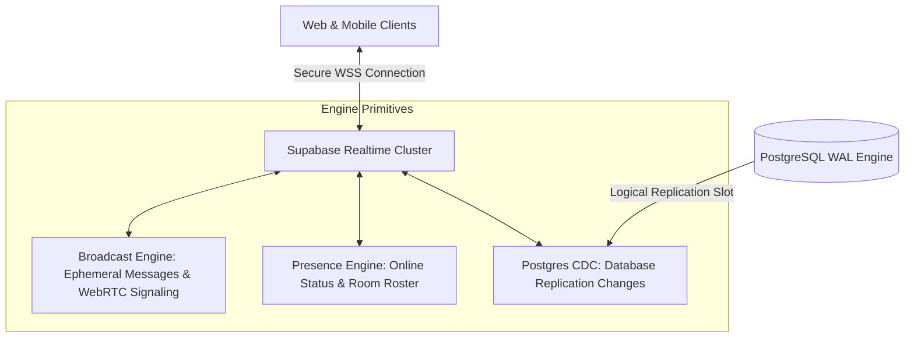

# TUKUBI Realtime Subsystem Architecture

**Status:** Production Ready  
**Version:** September 2026 Master Baseline  

---

## 1. Realtime Communication Topology

TUKUBI utilizes the Supabase Realtime Engine (distributed Elixir/Phoenix cluster) to deliver sub-50ms message propagation, presence tracking, and live media interaction.

---

## 2. Channel Taxonomy & Event Routing

| Channel Pattern | Protocol Primitive | Payload Description | Security / Scope |
| :--- | :--- | :--- | :--- |
| `realtime:user:{user_id}` | `postgres_changes` | In-app push notifications, badge updates, order status changes. | Scoped to authenticated recipient (`user_id = auth.uid()`). |
| `realtime:conversation:{id}` | `postgres_changes` `broadcast` | New chat messages, read receipts, live typing indicators. | Restricted to verified participants in `conversation_participants`. |
| `realtime:live:{stream_id}` | `broadcast` `presence` | Live chat reactions, viewer counter heartbeats, host stream state. | Public or ticketed live stream viewers. |
| `realtime:community:{id}` | `broadcast` | Island hub announcements, channel creation notices. | Members of the designated community. |

---

## 3. High-Load Optimization & Connection Resilience

1. **Selective Replication Slots:** Only tables requiring immediate client reactivity are added to the Supabase Realtime publication (`chat_messages`, `notifications`, `conversation_participants`). High-frequency partitioned tables (`analytics_events`) are excluded from WAL replication.
2. **Reconnection Exponential Backoff:** The client SDK (`@caribbean/messaging`) implements exponential backoff with jitter (500ms to 30s) to prevent thundering herd spikes during network transitions across Caribbean mobile cell towers.
3. **Presence Throttling:** Presence heartbeats are throttled to 15-second intervals, conserving device battery and reducing WebSocket message volume.
