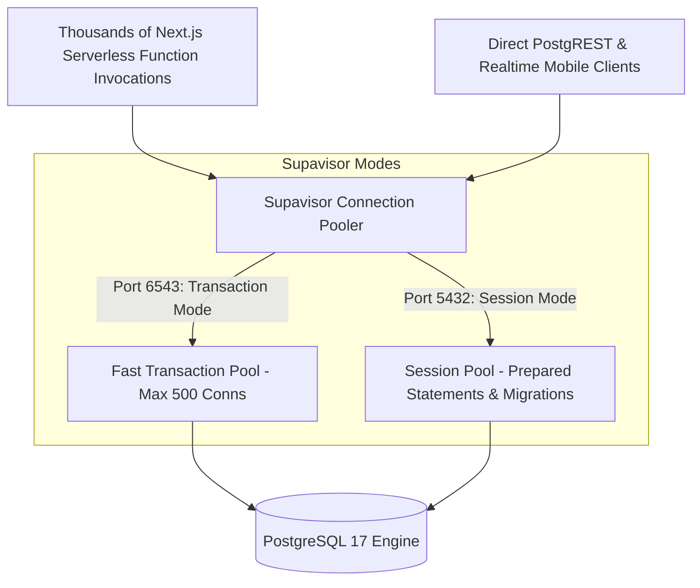

# TUKUBI Platform Scaling Strategy

**Status:** Production Ready  
**Version:** September 2026 Master Baseline  

---

## 1. Concurrency Architecture & Connection Pooling

As traffic surges during major Caribbean cultural events (Trinidad Carnival, Barbados Crop Over, Jamaica Reggae Sumfest, Miami Carnival), connection management is paramount to prevent PostgreSQL backend exhaustion.

- **Transaction Mode (Port 6543):** Mandated for all Next.js Server Actions and serverless functions. Connections are returned to the pool immediately upon transaction completion, enabling tens of thousands of concurrent client requests on a 50-connection Postgres instance.
- **Session Mode (Port 5432):** Reserved exclusively for schema migrations, long-lived background jobs, and developer administrative tools.

---

## 2. Horizontal & Vertical Scaling Rails

1. **Read Replica Offloading:** Read-only feeds and search queries route to regional read replicas in `us-east-1` (and diaspora nodes in `eu-west-1` as traffic expands).
2. **Dynamic Compute Provisioning:** Supabase compute size scales vertically during scheduled national festival peaks (scaling from 4-core 16GB RAM to 16-core 64GB RAM) with zero schema migration required.
3. **Partition Maintenance:** Range-partitioned `feed_activity_timeline` and `analytics_events` ensure historical data volume does not degrade write performance.
4. **Edge Caching:** Static cultural assets, sound previews, and public profiles utilize Cloudflare Edge caching with `stale-while-revalidate` caching headers.
