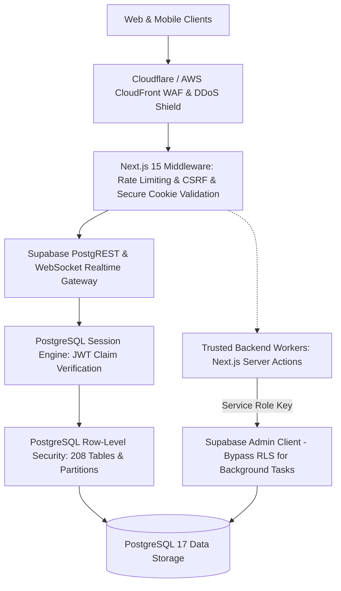

# TUKUBI Security Architecture & Threat Model

**Status:** Production Ready  
**Version:** September 2026 Master Baseline  
**Classification:** Internal Engineering Standard  

---

## 1. Threat Model & Risk Analysis (STRIDE)

| Threat Category | Potential Vector in TUKUBI | Architectural Countermeasure | Implementation Verification |
| :--- | :--- | :--- | :--- |
| **Spoofing** | Forged authentication tokens or impersonating another island user/business. | Cryptographically signed Supabase Auth JWTs stored in `HttpOnly`, `SameSite=Lax`, `Secure` cookies. Zero client token mutation. | Verified in `@caribbean/auth` middleware and SSR session handler. |
| **Tampering** | Modifying financial ledger balances, post reactions, or community roles via direct REST/GraphQL calls. | RLS enforced across all 208 tables. Double-entry ledger tables reject updates/deletions. Administrative RPCs restricted strictly to `service_role`. | Verified in migration `00093` and automated test suite. |
| **Repudiation** | Denying an administrative ban, community rule change, or creator payout initiation. | Append-only `audit_logs` and `moderation_actions` capturing actor UUID, client IP, user agent, and mutation payload. | Database triggers log all privileged operations. |
| **Information Disclosure** | Scraping unlisted profiles, secret communities, private direct messages, or unredacted financial reports. | Granular RLS policies filtering by `auth.uid()`, participant junction status, or business membership. `reconciliation_reports` locked to `service_role`. | 0 public partitions or internal tables exposed to `anon`. |
| **Denial of Service** | Flooding chat WebSocket endpoints, partition bloat, or expensive full-table fuzzy searches. | Redis-backed rate limiting per IP and per user ID. Trigram search restricted to indexed columns with query length caps. Range/hash partitioning on chat and telemetry. | Upstash Redis rate limiting in Next.js middleware and hash partitioning `chat_messages`. |
| **Elevation of Privilege** | Exploiting `SECURITY DEFINER` functions or overriding `search_path` to execute malicious code as superuser. | Explicit `SET search_path = public` on all database functions. All 27 internal trigger functions revoked from `PUBLIC`/`anon`/`authenticated`. Administrative RPCs locked to `service_role`. | Verified 0 mutable search paths and 0 public administrative RPCs in DB audit. |

---

## 2. Multi-Tiered Security Perimeter

---

## 3. Principle of Least Privilege & PostgreSQL Roles

PostgreSQL enforces strict role boundaries:

1. **`anon` (Unauthenticated Web Visitors):**
   - Read-only access to explicitly public resources (public creator posts, public community discovery, marketplace public listings, verified business directory).
   - Zero access to messaging, wallets, orders, private communities, or telemetry.
   - Strictly 1 safe view-counter RPC allowed (`increment_help_article_views`). All other 52 `SECURITY DEFINER` functions revoked.

2. **`authenticated` (Logged-In Caribbean Users):**
   - Access governed by row-level ownership (`user_id = auth.uid()`) or verified membership junctions (`business_members`, `community_members`, `conversation_participants`).
   - Zero direct execution rights on internal trigger functions.

3. **`service_role` (Trusted Server-Side Infrastructure):**
   - Used exclusively in secure server-side Next.js Server Actions and edge background workers.
   - Required to execute administrative maintenance functions (`create_monthly_partition`, `log_admin_action`, `allocate_founder_number`, `award_badge`, `revoke_badge`, `bootstrap_official_tukubi_account`, `seed_default_community_roles`).
   - Completely inaccessible from client browsers or mobile applications.

---

## 4. Financial & Ledgers Security Mandates

- **Zero Mutable Column Increments:** `UPDATE wallets SET balance = balance + 10` is strictly banned in all codebase packages and migrations.
- **Atomic Balance Derived from Ledger:** User balance is verified against the double-entry ledger state before approving payouts.
- **Idempotency Keys:** Every payment request requires a UUIDv4 idempotency key to eliminate duplicate charges.
- **Zero Third-Party Vendor Bypass:** All payments flow exclusively through Stripe Connect and PayPal rails with verified webhooks and signature verification. Prohibited legacy mechanisms are rejected.
